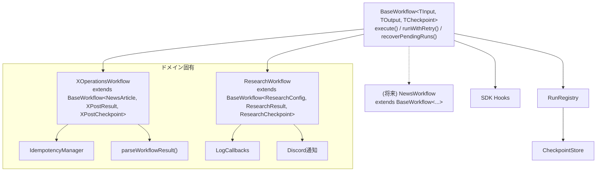

# P4-1: BaseWorkflow基盤 - タスク計画

## ゴール定義

### 目的

XOperationsWorkflow / ResearchWorkflow の共通パターンを `BaseWorkflow<TInput, TOutput, TCheckpoint>` 抽象基底クラスに抽出し、新エージェント追加時のボイラープレートを排除する。

### 完了条件

- [ ] BaseWorkflow抽象クラスが実装されている
- [ ] 共通エラーハンドリング・リトライ（指数バックオフ）が組み込まれている
- [ ] XOperationsWorkflow が BaseWorkflow を継承して動作する
- [ ] ResearchWorkflow が BaseWorkflow を継承して動作する
- [ ] 既存テスト（run-registry, idempotency）が通る
- [ ] BaseWorkflow のユニットテストがある
- [ ] 実行ログ・状態永続化が既存と同等以上

### スコープ外

- フェーズ単位の細粒度リトライ（将来拡張）
- P4-2 スケジューラーCLI/UI
- P4-3 承認レベル設定
- 新エージェントの追加

## 依存関係

### 内部依存

| 依存先                   | 理由                         | ステータス |
| ------------------------ | ---------------------------- | ---------- |
| subagent/run-registry.ts | 実行状態管理（そのまま利用） | ✅ 完了    |
| subagent/checkpoint.ts   | 永続化（そのまま利用）       | ✅ 完了    |
| subagent/hooks.ts        | SDKフック（そのまま利用）    | ✅ 完了    |
| x-operations/workflow.ts | 移行対象                     | ✅ 存在    |
| research/workflow.ts     | 移行対象                     | ✅ 存在    |
| orchestrator/llm/        | LLMProvider型                | ✅ 存在    |

### 外部依存

なし（既存パッケージのみ）

## WBS

### Step 1: BaseWorkflow抽象クラス作成

ファイル: `src/orchestrator/agents/subagent/base-workflow.ts`

```typescript
abstract class BaseWorkflow<
  TInput,
  TOutput,
  TCheckpoint extends Record<string, unknown>,
> {
  // 共通フィールド
  protected registry: RunRegistry;
  protected llmProvider: LLMProvider | null;

  // 共通ライフサイクル
  async execute(input: TInput): Promise<TOutput>; // テンプレートメソッド
  protected abstract run(runId: string, input: TInput): Promise<TOutput>; // 各ドメインが実装
  protected abstract get agentName(): string;
  protected abstract initCheckpoint(input: TInput): TCheckpoint;

  // 共通機能
  protected async updatePhase(runId: string, phase: string): Promise<void>;
  protected async runWithRetry<T>(
    fn: () => Promise<T>,
    opts?: RetryOptions,
  ): Promise<T>;
  async recoverPendingRuns(): Promise<void>;

  // SDK統合ヘルパー
  protected async streamAgent(
    runId: string,
    prompt: string,
    agentDef: AgentDef,
  ): AsyncGenerator<Event>;
}
```

抽出する共通パターン:

- `registry.start()` → チェックポイント初期化 → `run()` → complete/fail
- `llmProvider?.chatStreamWithAgent` の存在チェック
- イベントストリームのイテレーション
- `recoverPendingRuns()` のフィルタリングロジック

- [ ] S1-1: BaseWorkflow抽象クラス実装
- [ ] S1-2: RetryOptions型 + 指数バックオフユーティリティ
- [ ] S1-3: subagent/index.ts からエクスポート追加

### Step 2: 共通エラーハンドリング・リトライ

`runWithRetry()` の仕様:

- デフォルト: 最大3回、初期遅延1秒、指数バックオフ（×2）
- ワークフロー全体をリトライ（execute単位）
- リトライ時は新しいrunIdを生成（前回のrunはfailed記録）
- 設定可能: `{ maxRetries, initialDelay, backoffMultiplier, retryableErrors? }`

- [ ] S2-1: リトライロジック実装（base-workflow.ts内）
- [ ] S2-2: リトライテスト

### Step 3: XOperationsWorkflow移行

```typescript
class XOperationsWorkflow extends BaseWorkflow<NewsArticle, XPostResult, XPostCheckpoint> {
  get agentName() { return "x-operations-agent"; }
  initCheckpoint(article) { return { articleId: article.id, phase: "analyzing", ... }; }
  async run(runId, article) { /* 既存のexecuteWorkflow本体 */ }
  // ドメイン固有: parseWorkflowResult, clearTempFiles, tryReadTempResult
  // IdempotencyManagerは既存のままcreatePost()でラップ
}
```

- [ ] S3-1: XOperationsWorkflowをBaseWorkflow継承に書き換え
- [ ] S3-2: createPost()のIdempotencyラッパーを維持
- [ ] S3-3: 既存テスト（idempotency.test.ts）が通ることを確認

### Step 4: ResearchWorkflow移行

```typescript
class ResearchWorkflow extends BaseWorkflow<
  ResearchConfig,
  ResearchResult,
  ResearchCheckpoint
> {
  get agentName() {
    return "research-agent";
  }
  initCheckpoint(config) {
    return { topic: config.topic, phase: "collecting" };
  }
  async run(runId, config) {
    /* 既存のexecuteWorkflow本体 */
  }
  // ドメイン固有: LogCallbacks, Discord通知
}
```

- [ ] S4-1: ResearchWorkflowをBaseWorkflow継承に書き換え
- [ ] S4-2: LogCallbacks/Discord通知を維持
- [ ] S4-3: index.tsの初期化コード更新

### Step 5: テスト・検証

- [ ] S5-1: BaseWorkflowユニットテスト（モックサブクラスで検証）
  - ライフサイクル: start → run → complete
  - エラー時: start → run(throw) → fail
  - リトライ: 一時的失敗 → リトライ → 成功
  - 復旧: pending run のリカバリ
- [ ] S5-2: 既存テスト全パス確認（pnpm test）
- [ ] S5-3: Gateway連携（xpost, research ハンドラー）の動作確認

### Step 6: 実行ログ・永続化の強化

- [ ] S6-1: BaseWorkflowにログフック（onStart, onComplete, onFail, onRetry）追加
- [ ] S6-2: types.tsのXPostCheckpointをx-operations側に移動（subagentからドメイン型を分離）

## アーキテクチャ図



## リスク・注意事項

| リスク                                | 影響度 | 対策                                               |
| ------------------------------------- | ------ | -------------------------------------------------- |
| 移行時にGatewayハンドラーが壊れる     | 高     | xpost.ts/research ハンドラーのインポートパスを確認 |
| execute()のシグネチャ変更             | 中     | 既存のcreatePost()/execute()をpublic APIとして維持 |
| XPostCheckpoint型のsubagentからの分離 | 低     | 段階的に移動、re-exportで後方互換維持              |
